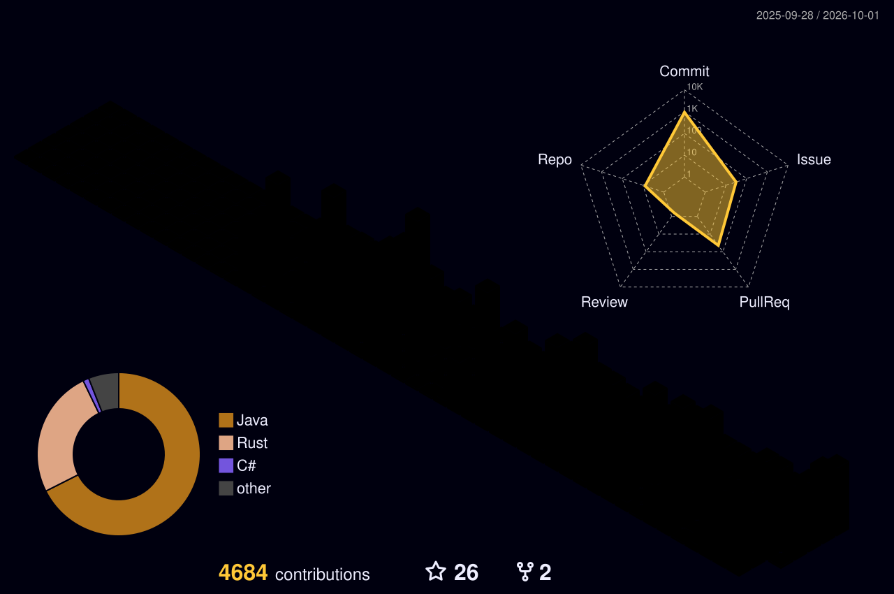

**Systems & Full-Stack Developer · C++ · Rust · TypeScript · Founder of [SoftDryzz](https://softdryzz.com)**

*From Ring 0 to the browser: I build hypervisors, reverse engineering tooling, security software, CLIs and web platforms.*

🌐 *[Leer en Español](README_ES.md)*

---

## ⚡ At a Glance

| | |
|---|---|
| 🔬 **Low-level** | Windows kernel drivers (WDK) · Type-1 hypervisor on Intel VT-x/EPT · x86-64 assembly |
| 🕵️ **Reverse engineering** | Ghidra · x64dbg · WinDbg · PE triage · isolated analysis lab |
| 🦀 **Open source** | 3 crates on crates.io · 40 public releases · 800+ tests in ProjectManager |
| 🧾 **Business software** | VeriFactu e-invoicing and a FIFO/IRPF capital-gains engine for the Spanish market |
| 📦 **Portfolio** | 50+ repositories · top languages by volume: C++, Java, Rust, TypeScript |

## 🔭 Right Now

- 🧾 Building a **VeriFactu-compliant e-invoicing application** (Rust · Axum · Tauri · SvelteKit)
- 📈 Building a **capital-gains tax engine** (FIFO / Spanish IRPF) for tax advisors
- ✍️ Writing a blog series on x86 privilege rings: [Ring 0](https://softdryzz.com/blog/posts/de-ring-3-a-ring-0) → [Ring -1](https://softdryzz.com/blog/posts/ring-menos-1-hipervisor) → Ring -2 (SMM) next
- 🛠️ Shipped [ProjectManager v2.1](https://github.com/SoftDryzz/ProjectManager/releases) (September 2026)

---

## 🧭 What I Work On

| Area | What it covers |
|---|---|
| 🔬 **Systems & Low-Level** | Windows kernel drivers (WDK), Type-1 hypervisors (VMX, EPT, VMCS, VM-exits), x86-64 assembly, Windows internals |
| 🕵️ **Reverse Engineering** | Ghidra, x64dbg, WinDbg, PE triage, unpacking, anti-debug analysis, process memory analysis, network protocol reversing |
| 🔒 **Security Tooling** | Threat detection, system monitoring, secrets management, offline licensing & anti-tamper, Linux server hardening |
| 🧾 **Regulated Business Software** | Spanish e-invoicing (VeriFactu / AEAT), tax calculation engines, audit trails |
| 🦀 **Backend & APIs** | Rust (Axum, Tower, Tokio), Java, Python (FastAPI), PostgreSQL, Redis |
| 🌐 **Frontend, Desktop & Mobile** | React, Next.js, Svelte/SvelteKit, TailwindCSS, Tauri, Flutter |
| 🎮 **Game Tooling & Modding** | Minecraft server plugins (Paper/Velocity), Meteor Client addons, game memory & protocol analysis |

---

## 📂 Featured Projects

### 🔬 Systems & Reverse Engineering

#### 🌀 Hyperion: Type-1 Hypervisor for Windows

*Intel VT-x hypervisor for Windows x64. Ring 0 kernel driver in C++ plus a Ring 3 loader in Rust, with VM introspection and anti-reversing protection.*

- ⚙️ **VMX core:** VMCS setup, VM-exit handler, x64 assembly entry stubs and CPUID emulation
- 🧱 **Memory virtualization:** EPT with MTRR-aware memory typing and deferred INVEPT batching
- 🔌 **Ring 0 → Ring 3 telemetry:** async double-buffer pipeline over an IOCTL gateway, Rust loader

<b>More internals</b>

- 🧱 Copy-on-write shadow page tables and 4 KB split paging
- 🪝 **EPT hooking & VMI:** kernel-side VM-exit filtering, execution path tracing and anomaly scoring
- 📊 **Performance:** sub-microsecond latency profiling and execution histograms, multi-layer anti-reversing
- 🧪 **Validation:** 5-phase gated deployment with fire-test validation, tested under nested virtualization

### 🔐 Security & Developer Tools

#### 🔐 [Vaultic v1.4: Secrets Manager](https://github.com/SoftDryzz/vaultic)

*CLI for securely managing secrets and configuration across teams, with Git-based sync. Published on [crates.io](https://crates.io/crates/vaultic).*

- 🔒 **Strong encryption:** age or GPG with multi-recipient support, no external cloud
- 🌍 **Multi-environment:** dev/staging/prod with smart inheritance, diff and missing-variable detection
- 🚀 **CI/CD ready:** `vaultic ci export` for GitHub/GitLab, `VAULTIC_AGE_KEY`, `--stdout` piping and CI-friendly exit codes

<b>More</b>

- 📋 **Audit trail:** JSON history of who changed what and when
- 🏷️ 6 releases, latest v1.4.2

#### 🛡️ Cerberus v1.0: Security Monitor for Windows

*Real-time process, executable and network monitoring with threat detection. Also available as an extended **Pro** edition.*

- 🔴 **Process monitor:** real-time analysis with risk scoring (0-100)
- 🔵 **Executable analyzer:** hash verification, PE analysis, VirusTotal integration
- 🟢 **Network & system:** per-process connections, startup items and scheduled tasks

<b>More</b>

- 🟣 **Alerts & reports:** native notifications, PDF export, auto-updater
- 🧪 119 unit tests
- ⭐ **Cerberus Pro:** extended threat intelligence and professional features

#### 🛠️ [ProjectManager v2.1: CLI](https://github.com/SoftDryzz/ProjectManager)

*One command for all your projects. Detects the project type and standardizes build/run/test with diagnostics, security and statistics.*

- 🔍 **Auto-detection:** 12+ project types (Gradle, Maven, Node.js, .NET, Python, Rust, Go, Flutter, Docker...)
- 🩺 **Diagnostics & security:** `pm doctor` with A-F scoring, `pm secure` and `pm audit`
- ✅ **800+ tests**, cross-platform (Windows, Linux, macOS), 30 releases

### 🦀 Open-Source Rust Crates

| Crate | What it does | Version |
|---|---|---|
| [**tower-rate-tier**](https://github.com/SoftDryzz/tower-rate-tier) | Tier-based rate limiting for Tower: per-plan limits (free/pro/enterprise), GCRA with per-request cost, in-memory (DashMap) or Redis storage, standard headers |  |
| [**tower-request-guard**](https://github.com/SoftDryzz/tower-request-guard) | One configurable guard instead of 3-4 layers: body size, per-route timeouts, Content-Type, required headers and JSON-bomb protection, with a dry-run `LogAndPass` mode |  |
| [**vaultic**](https://github.com/SoftDryzz/vaultic) | Secrets manager CLI (see above) |  |

Both Tower crates work with Axum, Hyper, Tonic and any Tower service.

### 🧾 Business Software

#### 🧾 VeriFactu E-Invoicing Application

*Self-hosted and desktop electronic invoicing for Spanish businesses, compliant with VeriFactu (AEAT, the Spanish tax agency).*

- 🔗 **VeriFactu compliance:** chained invoice fingerprints, XML serialization and SOAP submission to the AEAT, verifiable QR codes
- 🧭 **Strict invoice lifecycle:** backend-owned state machine that only shows official AEAT states
- 🖥️ **Two deployments:** Axum server or Tauri desktop app, same SvelteKit UI

<b>More</b>

- 📋 Audit log and licensing server architecture
- 🧪 QA reports, test invoice suites and a penetration-test self-assessment
- 🔄 Self-hosted CI runner

#### 📈 Capital-Gains Tax Engine

*B2B engine that computes capital gains and losses on investments with the FIFO method for Spanish income tax (IRPF), built for tax advisors.*

#### ⚽ Sports Matchmaking Platform

*Mobile and web platform to organize matches, manage teams, track statistics, book pitches and run leagues and tournaments.*

- 📱 Flutter app for iOS, Android and Web
- 🦀 Rust + Axum API (workspace with api, core, db and common crates)
- 🔔 Push notifications via Firebase (FCM + APNs)

### 🤖 AI & Automation

#### 🧠 Project Pandora: Self-Evolving Local AI Agent

*Autonomous AI agent that runs entirely on local hardware. 9 phases shipped.*

- 🧩 **Four specialized LLM brains:** conversation, code, reasoning and fast tasks (Qwen3, DeepSeek-R1 via Ollama)
- 🔁 **Self-evolution engine:** prompts and tools improved through benchmarks
- 🛑 **6-level autonomy ladder** with an emergency kill switch

<b>More</b>

- 🛠️ **Integrated tools:** files, code generation, Docker sandbox and web scraping
- 🎙️ **Bilingual voice pipeline:** Whisper STT, Kokoro TTS and Silero VAD
- 🗂️ **Persistent memory:** episodic memory plus a ChromaDB vector store
- 🦀 Rust modules via PyO3

### 🧩 More Projects

| Project | What it is | Stack |
|---|---|---|
| **Vrydex** 🔒 | SaaS developer dashboard: GitHub repository health (outdated dependencies, vulnerabilities) plus Linux server monitoring, with GitHub OAuth | Rust |
| **MineHub** 🔒 | Local Minecraft server management hub: players, console, permissions, mods, modpacks, texture packs and datapacks | Rust |
| **Hyperions MC network** 🔒 | Cross-play Minecraft network infrastructure: Velocity proxy in front of Paper 1.21 servers, shared MariaDB, status page monitored from Cloudflare, Discord bots and website | Java · TypeScript · Python |
| **ProLoginAuth · ProSkins** 🔒 | Commercial Paper 1.21 plugins for cross-play servers: premium auto-login verified against Mojang, password auth for non-premium players, Bedrock via Floodgate, and skins for non-premium players | Java |
| **Spectra** 🔒 | Discord bot for development-team servers: channel management, daily standups, GitHub webhooks and onboarding | TypeScript |
| **xt** 🔒 | Terminal-art generator (graffiti and glitch logos drawn with half-block characters) plus a personal CLI that cross-checks GitHub repos against local clones | JavaScript |
| [FileSystemMonitor](https://github.com/SoftDryzz/FileSystemMonitor) | Real-time file system change monitor for Windows | C# · WPF |
| [WindowsOptimizer](https://github.com/SoftDryzz/WindowsOptimizer) | Cleanup, startup management and system tweaks for Windows | C# · .NET 8 |
| [system_monitor](https://github.com/SoftDryzz/system_monitor) | Cross-platform CLI system monitor with health indicators and watch mode | Rust |

🔒 Private repository

---

## ✍️ Latest from the Blog

| Post | Topic |
|---|---|
| [Ring -1: the hypervisor watching over your kernel](https://softdryzz.com/blog/posts/ring-menos-1-hipervisor) | Hypervisors, VT-x/AMD-V, EPT, VBS/HVCI · C++ `CPUID` examples |
| [From Ring 3 to Ring 0: what happens when your code crosses into the kernel](https://softdryzz.com/blog/posts/de-ring-3-a-ring-0) | Privilege rings, syscalls, kernel defenses · C++ examples |
| [Why Rust remains the safest language in 2026](https://softdryzz.com/blog/posts/rust-memory-safety-2026) | Ownership, borrowing and memory safety |

*Bilingual posts (ES/EN). The code in the Ring 0 / Ring -1 series is compiled and run on Linux and Windows before publishing.* → [All posts](https://softdryzz.com/blog/)

---

## 🛠️ Tech Stack

**Languages**

**Systems & Reverse Engineering**

<b>Backend, frontend, mobile, data & DevOps</b>

**Backend & Runtime**

**Frontend & Mobile**

**Data & DevOps**

---

## 💼 What I Can Help With

Available for freelance work and collaborations through [softdryzz.com](https://softdryzz.com):

| Service | Description |
|---|---|
| 🕵️ **Reverse Engineering** | Binary and protocol analysis, software protection review, interoperability research |
| 🔬 **Low-Level Development** | Windows drivers, virtualization, performance-critical Rust/C++ |
| 🔒 **Security Tooling & Hardening** | Monitoring and detection tools, secrets management, server hardening |
| 💻 **Custom Software** | Desktop apps, CLIs, APIs, middleware and integrations |
| 🌐 **Web Development** | Landing pages, web platforms, e-commerce |
| 🧠 **Digital & AI Consulting** | Digitalization plans, AI integration, process automation |

---

## 🎓 Education & Certifications

| Title | Institution |
|---|---|
| **Multi-platform Application Development (DAM)** | Campus Cámara de Comercio de Sevilla |
| **Business Digitalization** | EOI (Escuela de Organización Industrial) |
| **Artificial Intelligence Specialist** | Founderz |

---

## 📈 GitHub Stats

  
  

  

  

---

## 📫 Contact Me

| | Email | Purpose |
|---|---|---|
| 📩 | **contact@softdryzz.com** | General inquiries and collaborations |
| 🛡️ | **security@softdryzz.com** | Security vulnerabilities & responsible disclosure |
| ⚖️ | **legal@softdryzz.com** | Commercial licensing |
| 👤 | **cristo@softdryzz.com** | Direct contact |

---

  
  &nbsp;&nbsp;
  

<i>"Code is like humor. When you have to explain it, it's bad." · Cory House</i>

<b>Let's build something awesome together!</b> 🚀

