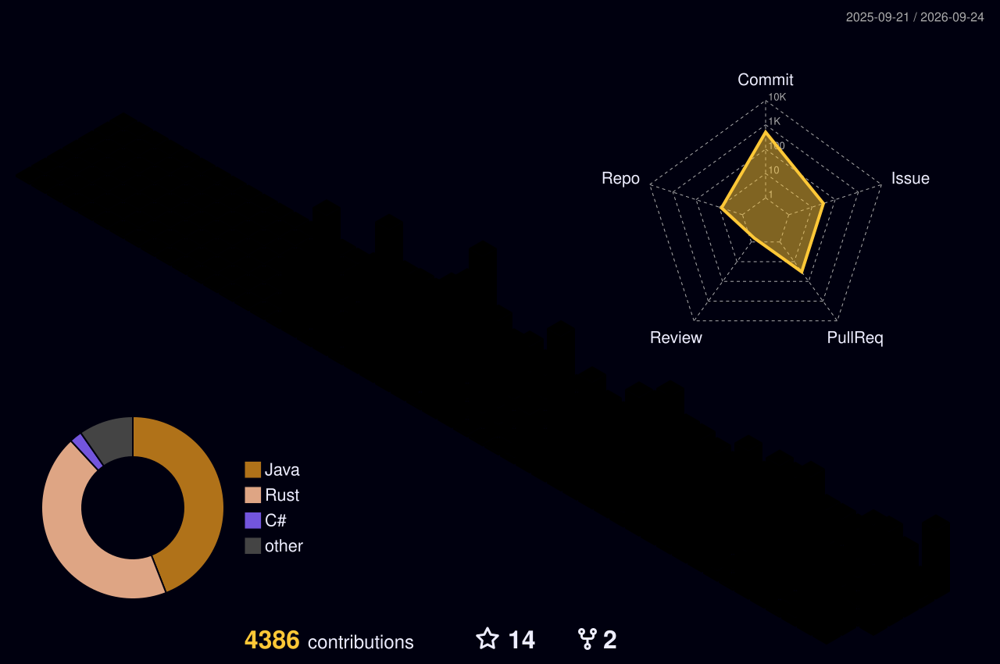

**Desarrollador de Sistemas y Full-Stack · Rust · C++ · TypeScript · Fundador de [SoftDryzz](https://softdryzz.com)**

*Del Ring 0 al navegador: construyo hipervisores, herramientas de ingeniería inversa, software de seguridad, CLIs y plataformas web.*

🌐 *[Read in English](README.md)*

---

## 🚀 Sobre Mí

- 🔬 **Bajo nivel primero:** Drivers de kernel de Windows, virtualización Intel VT-x e internals de x86-64. Me gusta saber qué está haciendo realmente la máquina.
- 🕵️ **Ingeniero inverso:** Análisis estático y dinámico de binarios, memoria de procesos y protocolos de red con Ghidra y x64dbg.
- 🔒 **Constructor de seguridad:** Detección de amenazas, monitorización de sistemas, gestión de secretos, licenciamiento y anti-manipulación.
- 🦀 **Backend y full-stack:** **Rust**, **C++**, **Java**, **TypeScript** y **Python**, desde middleware Tower hasta frontends React/Svelte y apps de escritorio con Tauri.
- 🤖 **IA y automatización:** Agentes de IA locales, integración de LLMs y automatización de procesos.

---

## 🧭 En Qué Trabajo

| Área | Qué abarca |
|---|---|
| 🔬 **Sistemas y Bajo Nivel** | Drivers de kernel de Windows (WDK), hipervisores Type-1 (VMX, EPT, VMCS, VM-exits), ensamblador x86-64, internals de Windows |
| 🕵️ **Ingeniería Inversa** | Ghidra, x64dbg, triaje de PE, unpacking, análisis anti-debug, análisis de memoria de procesos, reversing de protocolos de red |
| 🔒 **Herramientas de Seguridad** | Detección de amenazas, monitorización de sistemas, gestión de secretos, licenciamiento offline y anti-manipulación, hardening de servidores Linux |
| 🦀 **Backend y APIs** | Rust (Axum, Tower, Tokio), Java, Python (FastAPI), PostgreSQL, Redis |
| 🌐 **Frontend y Escritorio** | React, Next.js, Svelte, TailwindCSS, Tauri |
| 🎮 **Tooling y Modding de Juegos** | Plugins de servidor Minecraft (Paper/Velocity), addons de Meteor Client, análisis de memoria y protocolos de juegos |

---

## 📂 Proyectos Destacados

### 🔬 Sistemas e Ingeniería Inversa

#### 🌀 Hyperion: Hipervisor Type-1 para Windows

*Hipervisor Intel VT-x para Windows x64. Driver de kernel Ring 0 en C++ y loader Ring 3 en Rust, con introspección de máquina virtual y protección anti-reversing.*

- ⚙️ **Núcleo VMX:** Configuración de VMCS, manejador de VM-exits, stubs en ensamblador x64 y emulación de CPUID
- 🧱 **Virtualización de memoria:** EPT, tablas de páginas shadow con copy-on-write, tipado según MTRR y batching diferido de INVEPT
- 🪝 **Hooking EPT y VMI:** Introspección con filtrado de VM-exits en kernel, trazado de rutas de ejecución y scoring de anomalías
- 🔌 **Telemetría Ring 0 → Ring 3:** Pipeline asíncrono con doble buffer, control de desbordamiento y gateway IOCTL, con loader en Rust
- 📊 **Rendimiento:** Profiling de latencia sub-microsegundo e histogramas de ejecución, anti-reversing multicapa
- 🧪 **Validación:** Despliegue en 5 fases con puertas de control y fire-tests

---

### 🔐 Seguridad y Herramientas para Desarrolladores

#### 🔐 [Vaultic v1.4: Gestor de Secretos](https://github.com/SoftDryzz/vaultic)

*CLI para gestionar secretos y configuración de forma segura entre equipos, con sincronización basada en Git. Publicada en [crates.io](https://crates.io/crates/vaultic).*

- 🔒 **Cifrado robusto:** age o GPG con soporte multi-recipient, sin cloud externa
- 🌍 **Multi-entorno:** dev/staging/prod con herencia inteligente, diff y detección de variables ausentes
- 🚀 **Listo para CI/CD:** `vaultic ci export` para GitHub/GitLab, `VAULTIC_AGE_KEY`, salida por `--stdout` y códigos de salida pensados para CI
- 📋 **Registro de auditoría:** Historial JSON de quién cambió qué y cuándo

#### 🛡️ Cerberus v1.0: Monitor de Seguridad

*Monitor de seguridad privado para Windows con detección de amenazas en tiempo real.*

- 🔴 **Monitor de procesos:** Análisis en tiempo real con puntuación de riesgo (0-100)
- 🔵 **Analizador de ejecutables:** Verificación de hash, análisis PE, integración con VirusTotal
- 🟢 **Red y sistema:** Conexiones por proceso, programas de inicio y tareas programadas
- 🟣 **Alertas e informes:** Notificaciones nativas, exportación a PDF, auto-actualización, 119 unit tests

#### 🛠️ [ProjectManager v2.0: CLI](https://github.com/SoftDryzz/ProjectManager)

*Un comando para todos tus proyectos. Detecta el tipo y estandariza build/run/test con diagnósticos, seguridad y estadísticas.*

- 🔍 **Detección automática:** 12+ tipos de proyecto (Gradle, Maven, Node.js, .NET, Python, Rust, Go, Flutter, Docker...)
- 🩺 **Diagnóstico y seguridad:** `pm doctor` con puntuación A-F, `pm secure` y `pm audit`
- ✅ **800+ tests:** Multiplataforma (Windows, Linux, macOS)

---

### 🦀 Crates de Rust

#### 🌐 [Tower Rate Tier v0.2](https://github.com/SoftDryzz/tower-rate-tier) · [crates.io](https://crates.io/crates/tower-rate-tier)

*Middleware de rate limiting por niveles para Tower. Límites por plan (free/pro/enterprise), coste por petición, storage intercambiable y headers estándar.*

- 📈 **Algoritmo GCRA** con coste por petición y ventanas diarias o personalizadas
- 🔌 **Storage intercambiable:** En memoria (DashMap) o Redis para múltiples servidores
- 🎛️ **Personalizable:** Callback `on_limited` y respuestas 429 a medida, benchmarks con Criterion
- 🏗️ **Nativo de Tower:** Axum, Hyper y cualquier servicio Tower, MSRV 1.75

#### 🧰 [Tower Request Guard v0.1](https://github.com/SoftDryzz/tower-request-guard) · [crates.io](https://crates.io/crates/tower-request-guard)

*Middleware de validación de peticiones para Tower. Sustituye 3-4 capas separadas por un único guard configurable.*

- 📏 **Validación:** Tamaño máximo de body, timeouts por ruta, Content-Type y headers obligatorios
- 💣 **Protección contra JSON bombs:** Validación de profundidad máxima de anidamiento
- 🧭 **Overrides por ruta** y modo `LogAndPass` (dry-run) para migraciones graduales
- 🏗️ **Nativo de Tower:** Axum, Tonic, Hyper o cualquier framework basado en Tower

---

## 🛠️ Stack Tecnológico

**Lenguajes**

**Sistemas e Ingeniería Inversa**

**Backend y Runtime**

**Frontend**

**Datos y DevOps**

---

## 💼 En Qué Puedo Ayudarte

Disponible para trabajos freelance y colaboraciones a través de [softdryzz.com](https://softdryzz.com):

| Servicio | Descripción |
|---|---|
| 🕵️ **Ingeniería Inversa** | Análisis de binarios y protocolos, revisión de protecciones de software, investigación de interoperabilidad |
| 🔬 **Desarrollo de Bajo Nivel** | Drivers de Windows, virtualización, Rust/C++ de alto rendimiento |
| 🔒 **Seguridad y Hardening** | Herramientas de monitorización y detección, gestión de secretos, hardening de servidores |
| 💻 **Software a Medida** | Apps de escritorio, CLIs, APIs, middleware e integraciones |
| 🌐 **Desarrollo Web** | Landing pages, plataformas web, e-commerce |
| 🧠 **Consultoría Digital e IA** | Planes de digitalización, integración de IA, automatización de procesos |

---

## 🎓 Formación y Certificaciones

| Título | Institución |
|---|---|
| **Desarrollo de Aplicaciones Multiplataforma (DAM)** | Campus Cámara de Comercio de Sevilla |
| **Digitalización de Empresas** | EOI (Escuela de Organización Industrial) |
| **Especialista en Inteligencia Artificial** | Founderz |

---

## 📈 Estadísticas de GitHub

  
  

  

  

---

## 📫 Contáctame

| | Email | Uso |
|---|---|---|
| 📩 | **contact@softdryzz.com** | Consultas generales y colaboraciones |
| 🛡️ | **security@softdryzz.com** | Vulnerabilidades de seguridad y divulgación responsable |
| ⚖️ | **legal@softdryzz.com** | Licencias comerciales |
| 👤 | **cristo@softdryzz.com** | Contacto directo |

---

  
  &nbsp;&nbsp;
  

<i>"El código es como el humor. Cuando tienes que explicarlo, es malo." · Cory House</i>

<b>¡Construyamos algo increíble juntos!</b> 🚀

